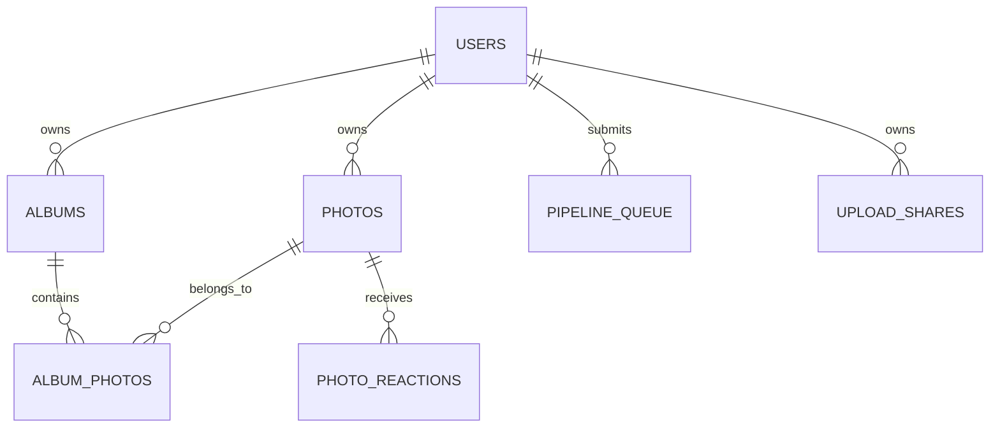

# Data model and ownership

The Drizzle schema in `backend/nodejs/database/schema.ts` is authoritative. `backend/contracts/schema.json` defines the cross-language minimum schema and immutable migration hashes used by Node and Go.

| Table                        | Responsibility                           | Important invariant                                                   |
| ---------------------------- | ---------------------------------------- | --------------------------------------------------------------------- |
| `users`                      | Identity, role and active state          | Security changes increment `auth_version` and invalidate old sessions |
| `photos`                     | Media metadata and storage keys          | Non-null owner; content hash deduplication is scoped to an owner      |
| `albums` / `album_photos`    | Album metadata and ordered membership    | Business logic prevents cross-owner membership                        |
| `pipeline_queue`             | Recoverable media jobs                   | Non-null owner, expiring claims and claim-token fencing               |
| `upload_shares`              | Visitor upload capability and quotas     | Token-hash lookup; resulting media inherits the share owner           |
| `settings`                   | Typed application configuration          | `(namespace,key)` is unique; secrets are not public output            |
| `settings_storage_providers` | Editable Local/S3/OpenList configuration | Provider secrets must be redacted by APIs and logs                    |

Owners are derived on the server from the authenticated user or upload-share record. A client-supplied owner id is never authoritative. Normal users are filtered to their own data; administrators may cross owner boundaries. Unauthorized object access returns 404 where practical.

Node and Go may share SQLite, but migration, pipeline consumption and scheduled backups each require exactly one runtime owner. Redis lease protection and SQLite claim-token fencing are complementary safeguards.

An application backup of SQLite does not include remote media bytes. Disaster recovery requires the database, stable signing secrets, storage configuration and object-store retention/versioning.
