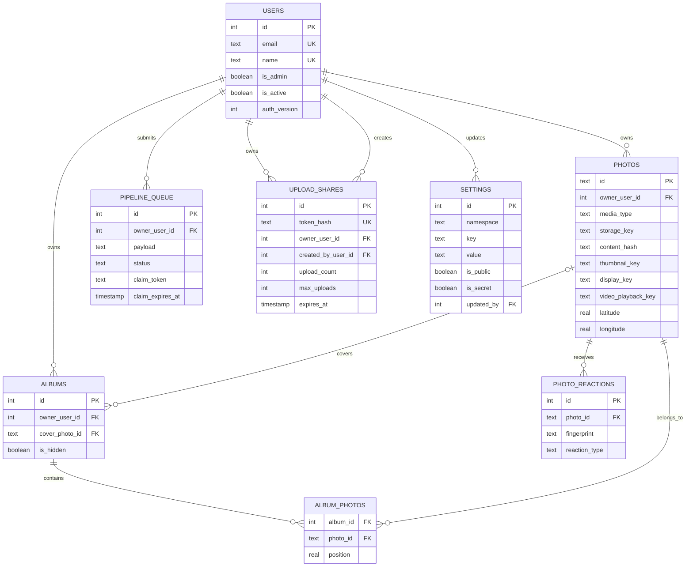

# 数据模型、归属与一致性

> 代码权威：`backend/nodejs/database/schema.ts`。跨语言最低兼容要求由 `backend/contracts/schema.json` 描述，迁移顺序由 Drizzle journal 和 SQL bytes 决定。

## 1. 核心实体关系



## 2. 表责任

| 表                           | 责任                            | 关键一致性规则                                                                  |
| ---------------------------- | ------------------------------- | ------------------------------------------------------------------------------- |
| `users`                      | 登录身份、管理员角色、启用状态  | email/name 唯一；安全字段变化触发 `auth_version` 增长，使旧 session 失效        |
| `photos`                     | 照片/视频元数据和所有媒体 key   | `owner_user_id` 非空；同一 owner 通过 `content_hash` 检测内容重复               |
| `albums`                     | 相簿元数据、隐藏状态、封面      | owner 非空；封面删除时设为 null                                                 |
| `album_photos`               | 相簿与照片多对多关系及排序      | 删除相簿或照片时关系级联删除；业务层禁止跨 owner 关联                           |
| `photo_reactions`            | 匿名或登录访问者的反应          | 删除照片时级联删除；fingerprint 用于重复反应控制                                |
| `pipeline_queue`             | 可恢复的媒体异步任务            | owner 非空；claim token、过期时间和 runtime lease 防止双 worker 提交            |
| `upload_shares`              | 访客上传授权、配额和审计        | token 只按 hash 查找；照片归 `owner_user_id`；创建者记录在 `created_by_user_id` |
| `settings`                   | 全站配置                        | `(namespace,key)` 唯一；secret 不应通过公开接口回显                             |
| `settings_storage_providers` | 可编辑的 Local/S3/OpenList 配置 | config 是 provider-specific JSON；API 必须脱敏 secret                           |
| `__drizzle_migrations`       | 已应用迁移 ledger               | Node/Go migrator 必须识别完全相同的 SQL hash 和顺序                             |

## 3. 归属模型

```text
authenticated upload
  current user.id
    -> object key users/<id>/...
    -> pipeline_queue.owner_user_id
    -> photos.owner_user_id

visitor share upload
  token lookup
    -> upload_shares.owner_user_id
    -> object key users/<owner>/...
    -> pipeline_queue.owner_user_id
    -> photos.owner_user_id
```

客户端提交的 owner id 不能作为权威输入。普通用户的查询、修改和删除必须附带 owner 条件；管理员可以跨 owner 管理。越权资源返回 404，避免泄露资源存在性。

## 4. 用户删除与角色安全

- 管理员不能降级、停用或删除自己。
- 系统始终保留至少一个启用的管理员。
- 管理员必须先降级为普通用户，再执行删除。
- 删除普通用户前，其照片、相簿和未完成任务转移给执行操作的管理员。
- 对象存储文件不随用户删除而丢失；数据库 owner 与对象 key 的历史前缀可以不同，读取以数据库保存的 key 为准。

## 5. Queue 一致性

```text
pending + available_at <= now
  worker obtains Redis runtime lease
  atomic claim writes claimed_by + claim_token + claim_expires_at
  process original
    success -> write photo/derived keys -> completed
    recoverable failure -> attempts++ -> pending with later available_at
    exhausted -> failed + error_message
  stale worker token cannot commit over a newer claim
```

Node 和 Go 可以共享同一张 queue 表，但 `CFRAME_PIPELINE_CONSUMER` 必须只有一个 owner。Redis lease 是运行时保护，SQLite claim token 是持久化 fencing，两者承担不同层次的防护。

## 6. 迁移规则

1. 先修改 Drizzle schema，并生成新的 SQL migration。
2. 不修改已经发布的历史 migration bytes。
3. 更新 `schema-requirements.json`，再生成 `schema.json` 和 Go migration manifest。
4. 执行 `pnpm contracts:check`、Node migration 测试和 Go migrator 验证。
5. 对生产数据库先备份，再以单一 migrator 执行迁移。
6. 迁移后检查 owner 非空、相簿关系数、照片数和 queue 状态分布。

## 7. 索引与主要访问路径

| 索引/路径                          | 服务场景                                   |
| ---------------------------------- | ------------------------------------------ |
| `idx_photos_owner_content_hash`    | 同一用户上传内容去重                       |
| `idx_photos_last_modified`         | 默认按最近更新时间/拍摄时间展示            |
| `idx_photos_location`              | 地图和地球仪只读取有坐标照片               |
| `idx_album_photos_album_position`  | 相簿内稳定排序                             |
| `idx_pipeline_queue_ready`         | 按状态、可执行时间、优先级和创建时间 claim |
| `idx_pipeline_queue_claim_expires` | 回收超时任务                               |
| `idx_upload_shares_token_hash`     | 不保存明文作为主要查找凭据                 |
| `idx_namespace_key`                | 设置按命名空间和 key 读取                  |

## 8. 数据边界与备份

- SQLite 是业务真相；Redis 可重建但会影响 session、资格、限流和 lease。
- 对象存储是媒体真相；数据库备份不包含远端对象字节。
- 完整灾备需要同时保留 SQLite、固定会话/OG 签名密钥、对象存储和必要 provider 配置。
- 邮件数据库备份只能恢复结构与业务元数据，不能替代对象存储版本控制或跨区域备份。
