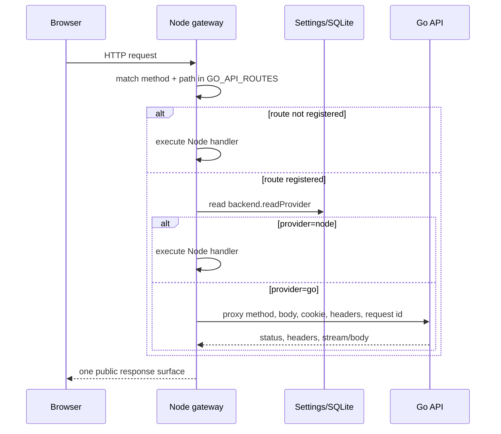

# 核心请求与任务生命周期

## 1. 可交互流程图

- [公开访问与媒体授权时序](/architecture/access-media.html)：访问密码、预览额度、Cookie 和媒体代理。
- [媒体上传与派生数据流](/architecture/media-pipeline.html)：登录上传、访客上传、queue、媒体工具链与归属。
- [系统总览](/architecture/chronoframe-current.html)：前端、Node、Go、SQLite、Redis 和对象存储边界。

## 2. Node / Go 请求分流



重要约束：客户端永远不选择 provider。切换由服务端配置控制，Go 只能接收 registry 中允许的请求。

## 3. 登录与即时角色变更

```text
POST /api/login
  normalize email
  load active user
  verify password
  create signed session containing identity + authVersion

every protected request
  verify signed session
  load current user from database
  require isActive
  require session authVersion == users.auth_version
  authorize current isAdmin / ownership
```

角色、密码或启用状态改变时，数据库 trigger 增加 `auth_version`。旧 session 随后无法继续授权，因此提升、降级和停用不依赖用户重新登录或等待缓存过期。

## 4. 匿名公开访问

```text
request public page/API
  logged in -> full permitted view
  protection disabled -> full public view
  valid access cookie + current password version -> full public view
  otherwise -> preview entitlement
    photos <= configured preview photo count
    albums <= configured preview album count
    album contents <= configured photo count
    map/globe/album-flow use the same visible-photo set
```

前端路由中间件负责用户体验，后端 API 和媒体路由负责安全边界。不能只在页面隐藏“查看更多”按钮。

## 5. 登录用户上传

```text
select files
  calculate/submit content hash metadata
  POST /api/photos prepare
    validate mime/type and ownership
    reject same-owner duplicate content when applicable
    choose active storage provider
    allocate users/<userId>/... key
  upload bytes
  enqueue pipeline task with ownerUserId
  UI polls task states until every selected file is terminal
```

文件名只用于展示和生成安全 key 的一部分，不是重复照片的身份。内容哈希才用于同一 owner 范围内的可靠去重。

## 6. 访客分享上传

```mermaid
sequenceDiagram
    participant U as Logged-in user
    participant A as Upload-share API
    participant V as Visitor
    participant O as Object storage
    participant Q as pipeline_queue
    U->>A: create share(label, expiry, maxUploads)
    A-->>U: persistent link + token
    V->>A: open /upload/:token
    A->>A: hash token; check active/expiry/quota
    V->>A: prepare each file
    A->>O: allocate owner-isolated key
    V->>O: upload bytes through supported path
    A->>Q: atomically consume quota and enqueue owner task
    Q-->>V: per-file task id/status
```

分享链接的列表由数据库持久化，刷新页面后仍可查看和再次复制。明文 token 只在业务允许的范围内返回；数据库查找和比较使用 token hash。

## 7. Pipeline task

| 阶段                | 输入              | 输出                          | 失败处理                                   |
| ------------------- | ----------------- | ----------------------------- | ------------------------------------------ |
| preprocessing       | 原始对象、payload | 可解码临时输入                | 记录错误；按 attempts 决定重试             |
| metadata / EXIF     | 图片或视频流      | 尺寸、拍摄时间、相机、GPS     | 无 EXIF 不是任务失败；损坏媒体才失败       |
| thumbnail / display | 解码帧            | 小图和展示图 key              | 清理临时文件后重试                         |
| video               | MP4/HEVC 等输入   | H.264 浏览器播放文件、poster  | FFmpeg 不可用时 readiness 不应允许 Go 接管 |
| Live/Motion Photo   | 配对媒体          | live video key 和标志         | 保留可诊断的配对失败原因                   |
| reverse geocoding   | 经纬度            | 国家、城市、位置名            | 外部服务失败可重试，不应丢失 GPS           |
| finalize            | 全部派生结果      | `photos` row + completed task | 使用 claim token 防止过期 worker 覆盖      |

## 8. 照片详情与媒体读取

```text
GET photo page
  SSR/API reads visible metadata
  browser requests thumbnail/display first
  media route authorizes photo visibility again
  resolve database key -> provider stream
  honor If-None-Match / If-Modified-Since / Range
  original is requested only for zoom/download/full-quality needs
```

这条路径同时控制成本和安全：客户端不获得 S3/COS/OpenList 私有 key 或长期直链；列表不反复传输原图；视频和 Live Photo 支持 Range。

## 9. 分享预览图

```text
GET /share-og/:photoId.png
  authorize preview visibility
  create short-lived signed /og-media/:photoId URL
  renderer fetches original/display media through signed endpoint
  compose title + metadata + photo
  return PNG with cache headers
```

`NUXT_OG_IMAGE_SECRET` 应固定且至少 32 位。若缺失可兼容使用 session secret，但生产环境推荐单独配置。预览图没有原照片时，依次检查签名、容器内回源地址、对象读取和字体/渲染日志。

## 10. 备份任务

```text
schedule/manual trigger
  require exactly one backup scheduler owner
  checkpoint/copy SQLite consistently
  write backup artifact under CFRAME_BACKUP_DIR
  send email attachment when SMTP enabled
  retain/clean according to settings
```

Node 和 Go scheduler 不得同时运行。手动备份 API 可以触发一次任务，但不能突破管理员权限或覆盖 scheduler owner 约束。
