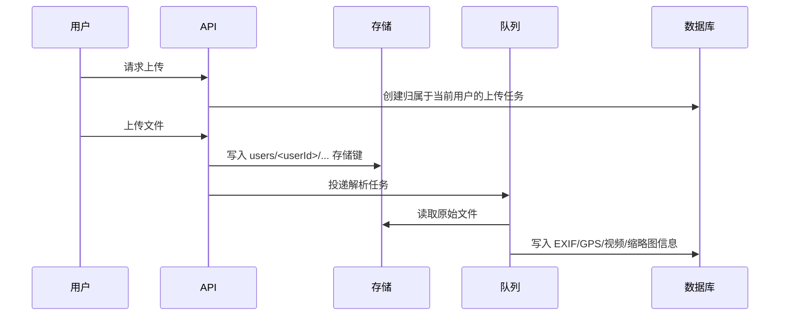

# 媒体、存储与地图

ChronoFrame 的媒体系统由三部分组成：对象存储、数据库记录和服务端媒体代理。对象存储保存原始文件和生成资源，数据库保存照片、相簿、归属、EXIF、GPS、视频等元数据，媒体代理负责鉴权并把文件安全返回给浏览器。

## 支持的媒体类型

| 类型         | 说明                                        |
| ------------ | ------------------------------------------- |
| 图片         | JPEG、PNG、WebP、GIF、BMP、TIFF、HEIC、HEIF |
| 视频         | MP4、MOV                                    |
| Live Photo   | Apple Live Photo 的图片 + MOV 组合          |
| Motion Photo | Google 标准 Motion Photo                    |

## 上传处理流程



新上传文件会使用包含用户 ID 的存储键，降低不同用户同名文件互相覆盖的风险。

## 媒体代理与访问控制

浏览器不会直接拿到底层 S3、OpenList 或本地文件的真实对象直链。图片、缩略图、视频、Live Photo 和下载都通过 ChronoFrame 服务端代理返回。

这样可以统一处理：

- 登录用户放行。
- 已输入访问密码的访客放行。
- 未输入访问密码的访客只允许访问预览范围内的媒体。
- 普通用户后台只能访问自己的媒体。
- 管理员可以访问所有媒体。
- 支持缓存、条件请求和 Range 请求。

如果某张图在列表里有记录但显示加载失败，通常优先检查媒体代理日志、存储配置和对象是否真实存在。

## 低成本展示图策略

为了降低腾讯云 COS/CDN 等对象存储的下行流量成本，图片上传处理时会额外生成一张展示图：

| 资源   | 用途                             | 说明                             |
| ------ | -------------------------------- | -------------------------------- |
| 缩略图 | 列表、相簿封面、地图点位         | WebP，小尺寸                     |
| 展示图 | 照片详情页、全屏查看、邻近预加载 | WebP，长边最多 2560px            |
| 原图   | 下载、管理员需要原始文件时       | 保留原始质量，不作为默认浏览资源 |

详情页默认加载展示图，而不是原图。这样公开访问者反复浏览大图时，通常只消耗压缩后的展示图流量。原图仍然保留在存储中，下载按钮和后台批量下载会继续使用原图。

历史照片如果还没有展示图，详情页第一次请求 `/display/:photoId` 时会按需生成展示图并写回存储，后续访问会直接复用。这样不需要一次性批量重建老图库，也能逐步降低反复浏览大图的流量。

## 本地存储

本地存储适合个人服务器、NAS 或单机部署。

推荐 Docker 配置：

```text
NUXT_PROVIDER_LOCAL_PATH=/app/data/storage
NUXT_PROVIDER_LOCAL_BASE_URL=/storage
```

并持久化 `/app/data`。

本地存储不是把文件直接暴露给 Nginx，而是由应用代理读取和鉴权。不要把 `/app/data/storage` 直接作为公开静态目录暴露。

## S3 兼容存储

支持 AWS S3、Cloudflare R2、MinIO、腾讯云 COS 等 S3 兼容服务。

常见配置项：

| 字段              | 说明                            |
| ----------------- | ------------------------------- |
| Endpoint          | S3 API 地址                     |
| Bucket            | Bucket 名称                     |
| Region            | 区域                            |
| Access Key ID     | 访问密钥 ID                     |
| Secret Access Key | 访问密钥                        |
| Prefix            | 存储前缀，可选                  |
| CDN URL           | CDN 域名，可选                  |
| Force Path Style  | MinIO 常用；腾讯云 COS 通常关闭 |

### 腾讯云 COS 示例

以广州区为例：

| 字段             | 示例                                    |
| ---------------- | --------------------------------------- |
| Endpoint         | `https://cos.ap-guangzhou.myqcloud.com` |
| Bucket           | `your-bucket-1250000000`                |
| Region           | `ap-guangzhou`                          |
| Force Path Style | 关闭                                    |

Bucket 建议保持私有读写。ChronoFrame 会通过服务端代理返回媒体，不需要把 Bucket 设为公开。

## OpenList 存储

OpenList 适合把已有网盘或远程文件系统作为后端。使用时请确认：

- OpenList API 地址可从服务器访问。
- 账号有上传、读取、删除权限。
- 根目录和前缀配置正确。
- 外部链接不要绕过 ChronoFrame 的权限控制。

## 视频支持

MP4/MOV 上传后会读取视频流信息。

如果输入视频是 H.264，通常可以直接作为浏览器播放资源。如果输入视频是 HEVC/H.265，会生成 H.264 播放版本，以提高浏览器兼容性。

视频处理依赖 FFmpeg/FFprobe。官方 Docker 镜像已经包含运行所需能力。自定义镜像或本地开发环境如果缺少 FFmpeg，视频缩略图、转码或播放资源可能失败。

## Live Photo

Apple Live Photo 通常由一张图片和一个 MOV 文件组成。建议同一批上传，并保留原始文件名关系，系统会尝试自动匹配。

如果 Live Photo 没有识别：

- 确认图片和 MOV 是否都上传成功。
- 确认队列任务没有失败。
- 确认 MOV 文件没有被浏览器或代理拦截。
- 查看系统日志中的 Live Photo 相关错误。

## EXIF 与 GPS

系统会尝试从照片和视频中提取：

- 拍摄时间。
- 相机品牌和型号。
- 镜头信息。
- 光圈、快门、ISO、焦距。
- GPS 纬度、经度、高度。
- 白平衡、曝光模式等 EXIF 字段。

如果后台显示“无 GPS 信息”，常见原因是：

- 原文件本身没有 GPS。
- 手机导出时移除了位置信息。
- 后台隐私设置开启了上传时擦除位置。
- 文件是视频或 Live Photo，GPS 在另一侧媒体里，需要队列合并。
- EXIF 解析任务失败。

## 地图和位置服务

地图显示和逆地理编码是两套能力。

| 能力       | 用途                            | 可选提供商                    |
| ---------- | ------------------------------- | ----------------------------- |
| 地图提供器 | 渲染地图瓦片和样式              | Mapbox、MapLibre、高德        |
| 位置提供器 | 根据 GPS 反查国家、省市、地点名 | Auto、高德、Mapbox、Nominatim |

国内部署推荐：

- 地图提供器选择高德。
- 位置提供器选择高德。
- 配置高德 Web 服务 Key。
- 如使用高德 JS API 安全密钥，也填入 Security JS Code。

个人开发者通常可以申请高德开放平台 Key，但需要遵守高德的配额、服务条款和域名/安全设置要求。
